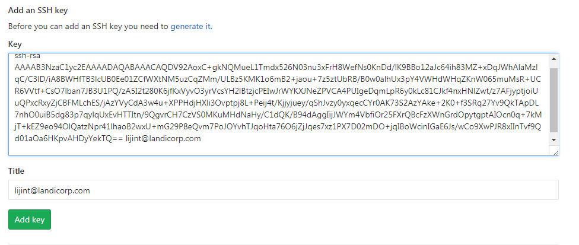

>Vue的学习中，要求使用gitlab作为版本控制工具,在gitlab注册过程中，需要配置ssh key，翻阅资料后决定根据官方文档配置，避免出现不必要的错误。网络上还有一种使用putty生成密钥对的方法，我这边就不赘述了。

首先，需检查本机中是否存在ssh key对，我们打开Git Bash(本人习惯用Git Bash linux命令操作)，敲入下面命令：

```shell
cat ~/.ssh/id_rsa.pub
```
如果电脑上还没有生成密钥对，则生成它：

```shell
ssh-keygen -t rsa -C "your_email@example.com"
```

生成后，在c盘用户文件里会有个.ssh文件夹，里面就存着要验证的密钥对，id_rsa是私钥，id_rsa.pub是公钥，用记事本打开id_rsa.pub，再将里面的内容全部拷到网上就可以了。

随后，只要点“Add key”就可以啦。
方法和gitHub上配置ssh类似，可参考[官方教程](https://help.github.com/articles/connecting-to-github-with-ssh/)


