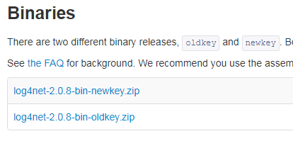
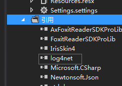

>log4net环境是一款非常强大的完全可编程配置的系统，在项目中引入这个系统可以使打印日志这项动作变得更加方便。本篇文章目的意在整理.Net程序中引入log4net系统的主要流程，以便大家学习和日后自己使用。先po上log4net[官网地址](http://logging.apache.org/log4net/release/manual/configuration.html)和[源码](https://github.com/lijint/logging-log4net)。

<!--more-->
# 项目引入log4net动态库
首先，在[官网](http://logging.apache.org/log4net/download_log4net.cgi)下载最新的库，然后在项目中引用这个库。官网上有newkey和oldkey两个版本，但建议下载newkey版

下好之后，在\bin\net\4.0\release里找到log4net.dll文件，将它引用到项目中


# 编写log4net.config配置文件

在所生成的可执行文件的路径（bin/Debug或者bin/Release）下，添加log4net.config配置文件
```xml
<?xml version="1.0" encoding="utf-8" ?>
<configuration>
  <configSections>
    <section name="log4net" type="log4net.Config.Log4NetConfigurationSectionHandler,log4net"/>
  </configSections>

  <log4net>
    <root>
      <priority value="ALL"/>
      <appender-ref ref="TraceAppender"/>
      <appender-ref ref="ConsoleAppender"/>
      <appender-ref ref="RollingFileAppender"/>
    </root>

    <logger name="FrameLog">
      <level value="DEBUG" />
      <additivity>false</additivity>
      <appender-ref ref="RollingFileAppender" />
    </logger>


    <appender name="TraceAppender" type="log4net.Appender.TraceAppender">
      <layout type="log4net.Layout.PatternLayout">
        <conversionPattern value="%date [%thread] %-5level %logger [%property{NDC}] - %message%newline"/>
      </layout>
    </appender>

    <appender name="ConsoleAppender" type="log4net.Appender.ConsoleAppender">
      <layout type="log4net.Layout.PatternLayout">
        <conversionPattern value="%date [%thread] %-5level %logger [%property{NDC}] - %message%newline"/>
      </layout>
    </appender>

    <appender name="RollingFileAppender" type="log4net.Appender.RollingFileAppender">
      <file value="Log\\"></file>
      <appendToFile value="true"></appendToFile>
      <maxSizeLogFileName value="20000KB"></maxSizeLogFileName>
      <maxSizeRollBackups value="10"/>
      <staticLogFileName value="false"/>
      <datePattern value="yyyyMMdd\\'App.log'"/>
      <rollingStyle value="Date"/>
      <!--<rollingStyle value="Size"/>-->
      <layout type="log4net.Layout.PatternLayout">
        <param name="ConversionPattern" value="%d 【%-5p】 %m%n"/>
      </layout>
    </appender>

  </log4net>
</configuration>
```

# 在AssemblyInfo.cs中配置

打开项目中AssemblyInfo.cs文件，在最低下一行加上一句话：
```csharp
[assembly: log4net.Config.XmlConfigurator(ConfigFile="Log4Net.config", Watch=true)]  
```

# 使用

一切配置完成后，就可以在项目里敲代码了。在底层新建一个日志类供上层调用：
```csharp
public static class Log
{
    public enum LogOption
    {
        All,
        Application,
        Package,
    }

    //这里的"FrameLog"为上面配置文件第15行的Name
    private static readonly ILog frameLog = LogManager.GetLogger("FrameLog");

    public static void Debug(object message)
    {
        frameLog.Debug(message);
    }

    public static void Debug(object message, Exception exception)
    {
        frameLog.Debug(message, exception);
    }

    public static void Info(object message)
    {
        frameLog.Info(message);
    }

    public static void Info(object message, Exception exception)
    {
        frameLog.Info(message, exception);
    }

    public static void Warn(object message)
    {
        frameLog.Warn(message);
    }

    public static void Warn(object message, Exception exception)
    {
        frameLog.Warn(message, exception);
    }

    public static void Error(object message)
    {
        frameLog.Error(message);
    }

    public static void Error(object message, Exception exception)
    {
        frameLog.Error(message, exception);
    }

    public static void ErrorWithPosition(object message)
    {
        frameLog.Error("[" + System.Reflection.MethodBase.GetCurrentMethod().DeclaringType.Name + "][" + System.Reflection.MethodBase.GetCurrentMethod().Name + "] Error  " + message);
    }

    public static void ErrorWithPosition(object message, Exception exception)
    {
        frameLog.Error("[" + System.Reflection.MethodBase.GetCurrentMethod().DeclaringType.Name + "][" + System.Reflection.MethodBase.GetCurrentMethod().Name + "] Error  "+message, exception);
    }

    public static void Fatal(object message)
    {
        frameLog.Fatal(message);
    }

    public static void Fatal(object message, Exception exception)
    {
        frameLog.Fatal(message, exception);
    }

    public static bool IsDebugEnabled
    {
        get { return frameLog.IsDebugEnabled; }
    }

    public static bool IsInfoEnabled
    {
        get { return frameLog.IsInfoEnabled; }
    }

    public static bool IsWarnEnabled
    {
        get { return frameLog.IsWarnEnabled; }
    }

    public static bool IsErrorEnabled
    {
        get { return frameLog.IsErrorEnabled; }
    }

    public static bool IsFatalEnabled
    {
        get { return frameLog.IsFatalEnabled; }
    }

    public static void DelLogByMonth(int monthsBefore, LogOption option)
    {
        if (monthsBefore <= 0)
            return;
        string from = DateTime.Now.AddMonths(-monthsBefore).ToString("yyyyMMdd");
        string to = DateTime.Now.ToString("yyyyMMdd");
        string dir = Application.StartupPath + "\\Log\\";
        string dic = null;
        foreach (string d in Directory.GetDirectories(dir))
        {
            dic = Path.GetFileName(d);
            if (int.Parse(dic) >= int.Parse(from) && int.Parse(dic) < int.Parse(to))
            {
                if (option == LogOption.All)
                    Directory.Delete(d, true);
                else if (option == LogOption.Application)
                    File.Delete(Path.Combine(d, "App.log"));
                else
                    File.Delete(Path.Combine(d, "Package.log"));
            }
        }
    }

    public static void DelLogByDay(int daysBefore, LogOption option)
    {
        if (daysBefore <= 0)
            return;
        string from = DateTime.Now.AddDays(-daysBefore).ToString("yyyyMMdd");
        string to = DateTime.Now.ToString("yyyyMMdd");
        string dir = Application.StartupPath + "\\Log\\";
        string dic = null;
        foreach (string d in Directory.GetDirectories(dir))
        {
            dic = Path.GetFileName(d);
            if (int.Parse(dic) >= int.Parse(from) && int.Parse(dic) < int.Parse(to))
            {
                if (option == LogOption.All)
                    Directory.Delete(d, true);
                else if (option == LogOption.Application)
                    File.Delete(Path.Combine(d, "App.log"));
                else
                    File.Delete(Path.Combine(d, "Package.log"));
            }
        }
    }
}
```
建好之后，外部就可以轻松使用了，本人比较习惯的是这样：
```csharp
Log.Error("[" + System.Reflection.MethodBase.GetCurrentMethod().DeclaringType.Name + "][" + System.Reflection.MethodBase.GetCurrentMethod().Name + "] err" + ex);
```
这样的好处就是可以快速定位程序中何处抛的异常


