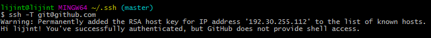
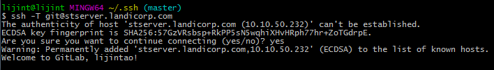

>在玩GitHub和gitlab时，两边都需要配置ssh key，但大部分的教程里配置的密钥对命名都是默认的，非常不爽，难道就没出现过同一台电脑管理两个密钥对的情况嘛？于是寻找了好多地方，终于找到解决方法，在这里坐个笔记。
<!--more-->

### 生成密钥对

随便一个地方打开git bash，然后进入c盘用户文件夹（c:/Users/xxx/），用命令：
```shell
cd ~
```
>这里默认win7环境下，GitHub密钥存放win7默认路径在用户文件夹下。

随后，可以开始生成ssh key了，这里我们维护两组，敲入如下命令
```shell
 ssh-keygen -t rsa -C "your email address"
```
敲入后按回车，会跳出让你输入文件路径和文件名，这时如果你按回车系统就会取默认的名字，即前面括号里的名字，因为我们要配置两个，所以我们要重新输入，路径按照前面括号里的写，文件名取成id_rsa_github，即要输入的是：C:\Users\xxx\.ssh\id_rsa_github，其中xxx是你自己的用户名。输完之后一直回车就可以了。
一直回车直到退出后可以按照上述步骤生成gitlab的ssh key，取名的时候取成id_rsa_gitlab，其他都一样，密码都为空。这些都做完之后，将公钥（.pub后缀的文件）添加进github和gitlab网站里（此步骤自行百度，太简单了）。

### 配置config（重要）
打开刚才生成密钥的文件夹（C:\Users\xxx\.ssh），右键打开git bash，分别输入下面命令
```shell
touch ~/.ssh/config
chmod 600 ~/.ssh/config
```
第一个是生成config文件夹，第二个是设置权限（管理员才有读写权限），然后用记事本打开config文件，贴入如下代码：
```shell
# 配置github
Host github.com                 
HostName github.com
IdentityFile C:\Users\xxx\.ssh\id_rsa_github
PreferredAuthentications publickey
User github

# 配置gitlab
Host stserver.xxx.com
HostName stserver.xxx.com
IdentityFile C:\Users\xxx\.ssh\id_rsa_gitlab
PreferredAuthentications publickey
User gitlab
```
其中的“xxx”都不是真实的，host是真实github地址和gitlab地址，hostname可以随便写，建议都一样，IdentityFile是刚才生成的密钥对的私钥地址（有.pub的是公钥，无后缀的是私钥），其他的可以抄我。

### 验证是否配对成功
在.ssh文件夹中打开git bash，输入命令：
```shell
ssh -T git@github.com
```
"@"后的是刚才配置的host地址，这个命令执行两次，分别和github和gitlab连接，最后成果是这样的:



参考教程：[Windows下Git多账号配置，同一电脑多个ssh-key的管理](http://www.cnblogs.com/popfisher/p/5731232.html)

>总结：虽然这是个很简单的东西，但弄完真的很有成就感，愿你每天都有成就感:smile: